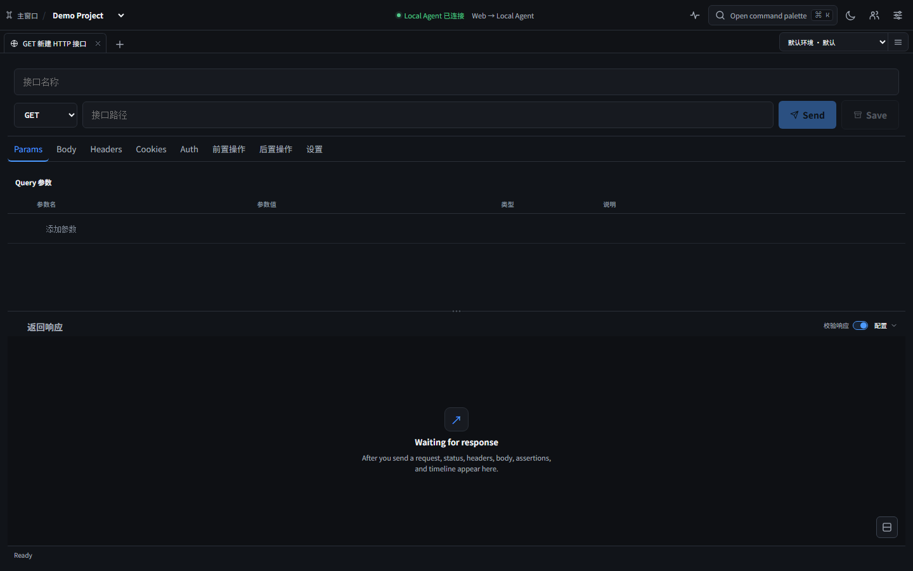

# ApiVoy

**Explore Every Protocol.**

[](https://github.com/aiLi0617/ApiVoy/actions/workflows/ci.yml)
[](https://github.com/aiLi0617/ApiVoy/releases)
[](LICENSE)
[](https://github.com/aiLi0617/ApiVoy/issues)

ApiVoy is a lightweight, local-first and extensible multi-protocol API debugging client for Windows, macOS, Linux and the Web.

ApiVoy provides a unified workspace for debugging HTTP, GraphQL, gRPC, WebSocket, SSE, TCP/UDP, MQTT, AMQP, Kafka, Redis and SQL protocols.

ApiVoy 是一款轻量、本地优先、可扩展的多协议接口调试工具。

## Preview



## Why ApiVoy?

A local-first, extensible workbench for API and infrastructure protocols.

- **Unified workspace** — one client for HTTP APIs and infrastructure protocols
- **Local-first** — SQLite storage, OS keychain secrets, no account required
- **Shared core** — Desktop, Web, CLI and Local Agent reuse the same Rust drivers
- **Extensible** — QuickJS scripts and WASM plugins (experimental)
- **Open source** — all code in this repository is Apache-2.0

## Features

- Multi-protocol request editor with streaming responses and execution timeline
- Environments, variables, assertions, and request history
- Import from cURL, OpenAPI, HAR, and Postman
- Code generation for HTTP and several protocol workbenches
- Collection execution in CLI with CI-friendly exit codes; the UI workflow will be consolidated into automation testing
- OS keychain-backed secret storage
- Optional traffic capture proxy (loopback defaults, sensitive header masking)
- Optional self-hosted collaboration and private deployment (preview)

## Supported protocols

| Protocol | Execute | Streaming | History | Code generation |
|----------|:-------:|:---------:|:-------:|:---------------:|
| HTTP/HTTPS | ✅ | ✅ | ✅ | ✅ |
| GraphQL | ✅ | ✅ | ✅ | ✅ |
| gRPC | Experimental | Experimental | ✅ | Experimental |
| WebSocket | ✅ | ✅ | ✅ | ✅ |
| SSE | ✅ | ✅ | ✅ | ✅ |
| TCP/UDP | ✅ | ✅ | ✅ | ✅ |
| MQTT | ✅ | ✅ | ✅ | Planned |
| AMQP | Experimental | Experimental | ✅ | Planned |
| Kafka | Experimental | Experimental | ✅ | Planned |
| Redis | ✅ | — | ✅ | Planned |
| SQL | ✅ | — | ✅ | Planned |

Legend: ✅ = Beta (verified by tests); **Experimental** = implemented but limited verification; **Planned** = not yet available; **—** = not applicable.

GraphQL is available via the HTTP workbench GraphQL body mode and a dedicated driver. See [examples/](examples/) and [docs/protocols/](docs/protocols/) for reproducible samples.

## Quick start

### Install the desktop application

Releases are built as GitHub Drafts first, then published after maintainer verification.

Current release target: [v0.2.0](https://github.com/aiLi0617/ApiVoy/releases/tag/v0.2.0). Draft assets include:

- **Windows**: `.msi`
- **macOS**: `.dmg`
- **Linux**: `.deb`
- **ApiVoy CLI** and **ApiVoy Local Agent** archives
- `SHA256SUMS.txt` for checksum verification

### Send your first request

1. Create a workspace.
2. Select **HTTP**.
3. Enter `https://httpbin.org/get`.
4. Click **Send**.
5. Inspect the response, timeline, and assertions.

For the Web workbench, start the Local Agent (`apivoy-agent`) and pair it from the Web UI.

## Development

### Requirements

- Node.js 22+
- pnpm 10.27+
- Rust stable
- Platform-specific [Tauri dependencies](https://v2.tauri.app/start/prerequisites/)
- Java 21 (only for `services/collaboration-server/`)

```bash
git clone https://github.com/aiLi0617/ApiVoy.git
cd ApiVoy
pnpm install
cargo check --workspace
pnpm dev:desktop
```

See [CONTRIBUTING.md](CONTRIBUTING.md) for validation commands and pull request expectations.

## Downloads

| Artifact | Binary | Description |
|----------|--------|-------------|
| Desktop | `apivoy` | Tauri desktop app |
| Local Agent | `apivoy-agent` | Headless protocol runtime for Web |
| CLI | `apivoy-cli` | CI and terminal automation |

Release assets include platform installers, CLI/Agent archives, and SHA-256 checksums.

## Security and privacy

- Secrets are stored in the OS keychain (Desktop) or Agent secret store; projects keep `secret_ref` only.
- Local Agent binds to loopback by default with Bearer token authentication.
- Do **not** report security vulnerabilities via public issues — see [SECURITY.md](SECURITY.md).

## Architecture

```text
Desktop / Web UI  →  Local Agent or Tauri commands  →  ExecutionEngine  →  Protocol drivers
CLI               →  ExecutionEngine (in-process)   →  Protocol drivers
```

Data defaults to **SQLite + local blob files + OS keychain**. Optional collaboration server and protocol gateway support self-hosted deployment.

Details: [docs/ARCHITECTURE.md](docs/ARCHITECTURE.md) · [docs/THREAT_MODEL.md](docs/THREAT_MODEL.md)

## Comparison

| Capability | ApiVoy |
|------------|--------|
| Local-first | ✅ |
| Open-source source code | ✅ |
| Desktop + Web + CLI | ✅ |
| HTTP / GraphQL / gRPC | ✅ |
| TCP/UDP / MQ / Redis / SQL | ✅ |
| WASM plugins | Experimental |
| Git-friendly workspace | ✅ |

## Roadmap

| Milestone | Focus |
|-----------|--------|
| **v0.1 Public Alpha** | First public release, core protocols, installers |
| **v0.2 Protocol Stability** | gRPC/MQ broker tests, compatibility matrix |
| **v0.3 Plugin Ecosystem** | Example WASM plugins, publisher docs |
| **v1.0 Stable** | i18n completion, auto-update, hardened defaults |

Track work on [GitHub Milestones](https://github.com/aiLi0617/ApiVoy/milestones).

## Contributing

We welcome issues and pull requests. Please read [CONTRIBUTING.md](CONTRIBUTING.md), [CHANGELOG.md](CHANGELOG.md), and [CODE_OF_CONDUCT.md](CODE_OF_CONDUCT.md).

Community discussion: [GitHub Discussions](https://github.com/aiLi0617/ApiVoy/discussions).

## Open-source scope

All source code contained in this repository is licensed under the Apache License 2.0, except for the ApiVoy trademarks and brand assets described in [NOTICE](NOTICE).

ApiVoy may offer separately developed hosted services in the future. Those services are not part of this repository.

Resources received through the Codex for Open Source program will be used exclusively for maintaining this public repository and its open-source workflows.

## License

Licensed under the [Apache License 2.0](LICENSE). ApiVoy name, logo, and slogan are not licensed under Apache-2.0 — see [NOTICE](NOTICE).
